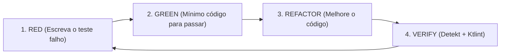

# TDD no Genesys21: Red-Green-Refactor Disciplinado

Esta skill orienta a implementação de novas funcionalidades e correções de bugs via **Test-Driven Development (TDD)** no ecossistema Genesys21.

---

## 1. O Ciclo Sagrado do TDD



1. **RED**: Escreva um teste unitário, de integração ou de screenshot que expresse o comportamento desejado. Execute o teste e confirme que ele **falha pelo motivo certo**.
2. **GREEN**: Escreva o menor volume de código necessário para fazer o teste passar. Não adicione abstrações desnecessárias nesta fase.
3. **REFACTOR**: Limpe o código, elimine duplicações, ajuste a nomenclatura e garanta o alinhamento com o **Genesys21 Dogma**.
4. **VERIFY**: Execute as ferramentas de análise estática e verifique se nenhum outro teste foi quebrado.

---

## 2. Estratégia de Testes por Módulo

### A. Módulo `:shared` (Kotlin Multiplatform)
* **Local dos Testes**: `shared/src/commonTest/kotlin/`
* **Escopo**: Domain use cases, ViewModels MVI, DTOs e lógica de validação.
* **Comando de Execução**:
  ```bash
  ./gradlew :shared:allTests
  ```

### B. Módulo `:server` (Ktor Server & Exposed ORM)
* **Local dos Testes**: `server/src/test/kotlin/`
* **Escopo**: Rotas HTTP Ktor, interceptores de autenticação Firebase, lógica de repositório SQLite e recálculo server-side de preços.
* **Padrão**: Utilizar `testApplication` do Ktor Test Host e `MockEngine`.
* **Comando de Execução**:
  ```bash
  ./gradlew :server:test
  ```

### C. Módulo `:screenshot-tests` (Paparazzi UI Testing)
* **Local dos Testes**: `screenshot-tests/src/androidUnitTest/kotlin/`
* **Escopo**: Telas Compose e componentes `PageComponent` renderizados visualmente em diferentes configurações de tela.
* **Comandos de Execução**:
  ```bash
  # Verificar se as screenshots atuais batem com os baselines gravados
  ./gradlew :screenshot-tests:verifyPaparazziDebug

  # Gravar novos baselines quando a UI for intencionalmente alterada
  ./gradlew :screenshot-tests:recordPaparazziDebug
  ```

---

## 3. Regras de Ouro no TDD do Genesys21

1. **Nunca escreva código de produção sem um teste falho prévio**: Se o teste passa de primeira, a asserção está incorreta ou o comportamento já existia.
2. **Teste Regras de Segurança Primeiro**: Ao adicionar rotas ou repositórios, crie testes para validar a prevenção de *Price Tampering* e *IDOR*.
3. **Paparazzi para Telas**: Qualquer novo componente da hierarquia `PageComponent` deve ter uma suíte de teste Paparazzi associada.
4. **Verificação Estática Obrigatória**:
   ```bash
   ./gradlew ktlintCheck detekt
   ```
