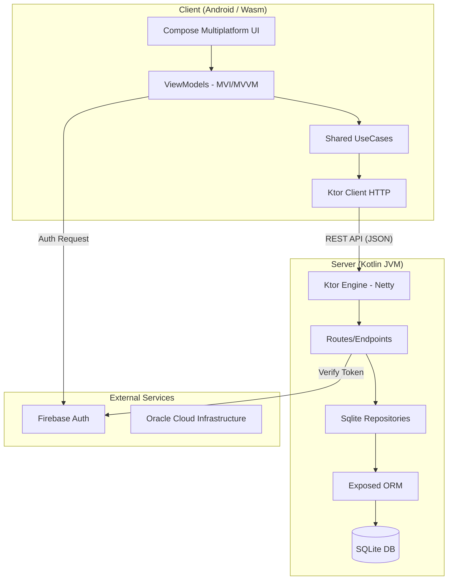

# Genesys21 - Documentação de Arquitetura

Esta documentação detalha a arquitetura técnica do projeto **Genesys21**, cobrindo desde a infraestrutura de backend até a interface de usuário multiplataforma.

---

## 1. Visão Geral do Sistema

O Genesys21 é uma plataforma de vitrines "White Label" que permite a criação, edição e publicação de páginas de vendas e agendamento de serviços em tempo real. O sistema é construído inteiramente em **Kotlin**, utilizando as tecnologias mais modernas de desenvolvimento multiplataforma.

### Diagrama de Fluxo de Dados

---

## 2. Estrutura de Módulos (KMP)

O projeto segue uma estrutura de **Kotlin Multiplatform (KMP)** para maximizar o reuso de código entre Android e Web (Wasm).

### `:shared` (Core Logic)
Módulo central que contém a inteligência de negócio.
- **Domain Layer**: Entidades (`Page`, `Product`, `BookingService`) e interfaces de Repositório.
- **UseCase Layer**: Lógica de aplicação (ex: `GetBookingServicesUseCase`, `SavePageUseCase`).
- **Data Layer**: Implementações de repositório usando **Ktor Client** para comunicação com o servidor.

### `:composeApp` (UI Layer)
Módulo que contém a interface visual construída com **Compose Multiplatform**.
- **Presentation**: Implementa o padrão **MVI (Model-View-Intent)** nos ViewModels para gerenciar estados complexos da UI.
- **Atoms/Molecules/Organisms**: Seguindo os princípios do **Atomic Design** para componentes reutilizáveis.
- **Design System**: Tokens de cores, tipografia e espaçamento compartilhados por todo o App.

### `:server` (Backend)
Servidor robusto rodando em Kotlin/JVM com **Ktor**.
- **Engine**: Netty.
- **Persistence**: **SQLite** com **Exposed ORM** para alta performance em ambientes de pequeno a médio porte.
- **Auth**: Integração nativa com **Firebase Admin SDK** para validação de tokens JWT.
- **Features**: Gerenciamento de imagens com `Thumbnailator`, compressão Gzip e suporte a CORS para domínios de produção.

### `:screenshot-tests` (Quality)
Framework de testes de regressão visual usando **Paparazzi**.
- Valida componentes em 3 resoluções (**Phone, Tablet, Desktop**) automaticamente.
- Garante que mudanças no código compartilhado não quebrem o layout em nenhuma plataforma.

---

## 3. Tecnologias de Ponta

| Camada | Tecnologia |
| :--- | :--- |
| **Linguagem** | Kotlin 2.3.21 |
| **UI** | Compose Multiplatform 1.10.0 |
| **Backend** | Ktor 3.0.x |
| **Banco de Dados** | SQLite + Exposed ORM |
| **Autenticação** | Firebase Auth |
| **Infraestrutura** | Oracle Cloud + Docker + Nginx |
| **Testes Visuais** | Paparazzi |

---

## 4. Estratégia de Deploy & DevOps

O projeto utiliza um pipeline automatizado para garantir estabilidade:
1. **Build**: Compilação paralela do WasmJs e do Server Jar.
2. **Qualidade**: Execução de Unit Tests e gravação de Screenshots (Paparazzi).
3. **Deploy**: Push para o **Oracle Cloud**, onde o container Docker é atualizado via script `up.sh`.
4. **SSL**: Segurança garantida via **Certbot** (HTTPS nativo).

---

## 5. Manutenibilidade e Escalabilidade

- **Whitelabel Nativo**: O sistema foi desenhado para ser customizável via código (`PageThemeConfig`) e via interface (`ThemeLab`).
- **Clean Architecture**: A separação rigorosa entre domínio e infraestrutura permite trocar o banco de dados ou a biblioteca de rede sem impactar a UI.
- **Responsividade**: O uso de `WindowSizeClass` garante que a experiência seja otimizada tanto para celulares quanto para monitores 4K.
