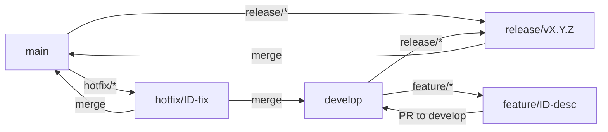

# Genesys21 - Kotlin Multiplatform Project

This is a Kotlin Multiplatform project targeting Android, iOS, Web, and Server (Ktor).

## 🚀 Getting Started

### 1. Firebase Configuration (Mandatory)

This project uses Firebase. You need to add the configuration files to the following locations (they are ignored by Git):

- **Android:** `composeApp/google-services.json`
- **iOS:** `iosApp/iosApp/GoogleService-Info.plist` (and add it to the project in Xcode)
- **Server:** `server/src/main/resources/genesys21-32035-firebase-adminsdk-fbsvc-d57f39d3c3.json`

### 2. CI/CD Configuration (GitHub Actions)

To make the CI pipeline work, you must add the following **Secrets** to your GitHub repository (`Settings > Secrets and variables > Actions`):

| Secret Name | Description |
| :--- | :--- |
| `GOOGLE_SERVICES_JSON_ANDROID` | Content of `composeApp/google-services.json` |
| `FIREBASE_ADMIN_JSON` | Content of the server's service account JSON |
| `GOOGLE_SERVICES_PLIST_IOS` | Content of `iosApp/iosApp/GoogleService-Info.plist` |

---

## 🐳 Running with Docker

You can run both the Server and Web applications using Docker Compose:

```shell
docker-compose up --build -d
```

- **Backend (Ktor):** http://localhost:8080
- **Frontend (Web/JS):** http://localhost:8081

---

## 📱 Development Build and Run

### Android
```shell
./gradlew :composeApp:assembleDebug
```

### Server (Ktor)
```shell
./gradlew :server:run
```

### Web
- **Wasm:** `./gradlew :composeApp:wasmJsBrowserDevelopmentRun`
- **JS:** `./gradlew :composeApp:jsBrowserDevelopmentRun`

### iOS
Open the `iosApp` directory in Xcode. 
**Note:** Before running, ensure you have added the Firebase SDK via Swift Package Manager (SPM) in Xcode.

---

## 📂 Project Structure

- [/composeApp](./composeApp/src): Shared UI code for all targets.
- [/iosApp](./iosApp/iosApp): iOS specific SwiftUI entry point.
- [/server](./server/src/main/kotlin): Ktor server application.
- [/shared](./shared/src): Shared business logic and platform abstractions.

Learn more about [Kotlin Multiplatform](https://www.jetbrains.com/help/kotlin-multiplatform-dev/get-started.html) and [Compose Multiplatform](https://github.com/JetBrains/compose-multiplatform/#compose-multiplatform).

# 🛠️ GitFlow Policy

> **Branch strategy:** `main` (production), `develop` (integration), `feature/*`, `release/*`, `hotfix/*`.




### Como começar
1. **Feature branch**
   ```bash
   git checkout -b feature/<ticket-id>-<short-desc> develop
   ```
2. **Pull Request**
   - Abra PR apontando para `develop`.
   - Use o template de PR padrão (`.github/pull_request_template.md`).
3. **Release**
   ```bash
   git checkout -b release/<version> develop
   ```
   - Abra PR para `main`.
   - O CI executa lint, testes, CodeQL e cobertura.
4. **Hotfix**
   ```bash
   git checkout -b hotfix/<ticket-id>-<desc> main
   ```
   - Abra PR para `main` e, após merge, também para `develop`.

### Scripts de apoio
- `scripts/gitflow_init.sh` automatiza a criação de branches e PRs.
- Consulte a política de proteção de branches em `.github/branch_protection.json`.
