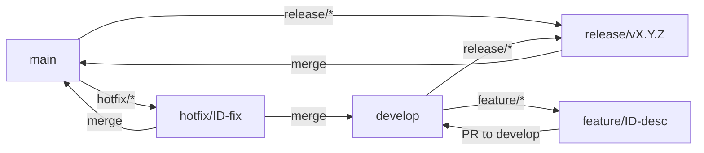

# 🧬 Genesys21

[](https://github.com/victorhugobenevides/Genesys21/actions/workflows/ci.yml)
[](https://github.com/victorhugobenevides/Genesys21/security/code-scanning)
[](http://kotlinlang.org)
[](https://github.com/JetBrains/compose-multiplatform)
[](https://ktor.io)

**Genesys21** is a high-performance, White-Label engine built with **Kotlin Multiplatform**. It allows merchants to create, customize, and publish professional sales vitrines and landing pages across Android, iOS, and Web using a single shared codebase.

---

## ✨ Key Features

- 🛠️ **Real-time WhiteLabel Editor**: Live preview engine to customize themes, components, and products.
- 🎨 **Dynamic Theme Engine**: Advanced styling with Glassmorphism, custom palettes, and curated typography.
- 📱 **Multi-platform Support**: Native Android & iOS apps, plus a high-performance Web (Wasm/JS) frontend.
- 📦 **Order Management**: Complete flow from product catalog to order tracking and customer notification via WhatsApp.
- ☁️ **Server-Driven Metadata**: Dynamic SEO and social preview generation for shared links.
- 🔒 **Security First**: Integrated Firebase Auth, CodeQL scanning, and robust CI/CD pipelines.

---

## 🛠️ Tech Stack

- **Core**: [Kotlin Multiplatform (KMP)](https://kotlinlang.org/docs/multiplatform.html)
- **UI**: [Compose Multiplatform](https://www.jetbrains.com/lp/compose-multiplatform/) (Shared UI for Android, iOS, Web)
- **Dependency Injection**: [Koin](https://insert-koin.io/)
- **Networking**: [Ktor Client](https://ktor.io/docs/client.html)
- **Database**: SQLDelight & Exposed (Server)
- **Backend**: [Ktor Server](https://ktor.io/docs/server-overview.html)
- **Images**: [Coil3](https://coil-kt.github.io/coil/)
- **Infrastructure**: Docker, Nginx, GitHub Actions
- **Backend Services**: Firebase (Auth, Analytics, Crashlytics, Performance)

---

## 📂 Project Structure

```bash
├── composeApp/      # Shared UI code (Compose Multiplatform)
│   ├── commonMain   # Main shared UI and navigation logic
│   ├── androidMain  # Android-specific UI/Lifecycle
│   └── wasmJsMain   # Web-specific (Wasm) logic
├── iosApp/          # iOS SwiftUI wrapper and entry point
├── shared/          # Shared Business Logic (Domain, Data, Repositories)
├── server/          # Ktor Backend (REST API, Database, SEO)
└── scripts/         # Dev automation scripts
```

---

## 🚀 Getting Started

### Prerequisites
- **JDK 17+**
- **Android Studio Ladybug+** (or IntelliJ IDEA)
- **Xcode 15+** (for iOS development)
- **Docker** (optional, for backend deployment)

### 1. Firebase Configuration (Mandatory)
Genesys21 requires Firebase to function. Add your `google-services.json` and `GoogleService-Info.plist` files:

- **Android:** `composeApp/google-services.json`
- **iOS:** `iosApp/iosApp/GoogleService-Info.plist`
- **Server:** `server/src/main/resources/firebase-adminsdk.json`

### 2. Environment Setup
Create a `local.properties` in the root:
```properties
sdk.dir=/path/to/android/sdk
WEB_BASE_URL=http://localhost:8081
```

---

## 📱 Development Guide

### Run Android App
```shell
./gradlew :composeApp:installDebug
```

### Run Server (Ktor)
```shell
./gradlew :server:run
```

### Run Web (Wasm/JS)
```shell
./gradlew :composeApp:wasmJsBrowserDevelopmentRun
```

### Run iOS
Open `iosApp/iosApp.xcworkspace` in Xcode and run the `iosApp` scheme.

---

## 🐳 Docker Deployment

Deploy the entire stack (Nginx, Ktor, Web) with a single command:
```shell
docker-compose up --build -d
```
- **Backend API**: `http://localhost:8080`
- **Frontend Web**: `http://localhost:8081`

---

## 🛡️ GitFlow & Contribution

This project follows a strict **GitFlow** policy to ensure stability.



1. **Feature**: Create from `develop`, PR back to `develop`.
2. **Release**: Create from `develop`, PR to `main`.
3. **Hotfix**: Create from `main`, PR to `main` and `develop`.

For more details, see [CONTRIBUTING.md](./CONTRIBUTING.md).

---

## 📄 License

Copyright © 2024 It Benevides. All rights reserved.
Developed by [Victor Hugo Benevides](https://github.com/victorhugobenevides).
